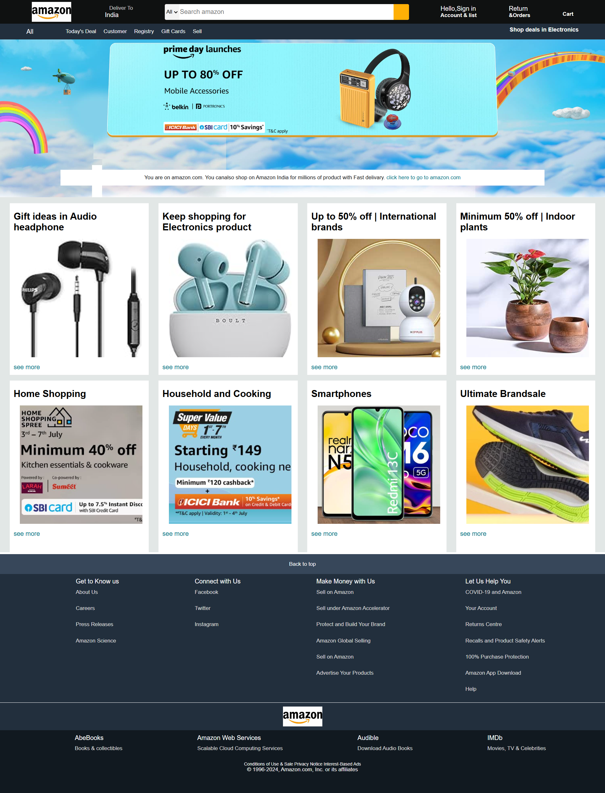

# Amazon-FrontEnd
Amazon frontend Using the HTML and Css.

## Project Overview
The **Amazon-FrontEnd** project is a user interface design inspired by Amazon's online shopping platform. This project demonstrates modern web design practices using HTML and CSS to create a visually appealing and responsive web application.

## Features
- **Dynamic and Interactive UI:** A responsive design that adjusts seamlessly across devices (desktop, tablet, mobile).
- **Custom Styling:** Utilizes CSS to style components and create an aesthetically pleasing layout.
- **Hero Section:** Eye-catching hero section with product highlights.
- **Image Carousel:** Displays various Amazon products and banners.
- **Reusable Components:** Modular structure for easier updates and maintenance.

## Project Structure
```
css-project/
|-- index.html          # Main HTML file
|-- style.css           # CSS for styling the application
|-- amazonlogo2.jpg     # Amazon logo image
|-- amazonlogo3.png     # Alternate Amazon logo
|-- heroimg.jpg         # Hero section background image
|-- box1.jpg - box8.jpg # Product images for the showcase
|-- .git/               # Git repository configuration files
```

## Getting Started
### Prerequisites
- A web browser (e.g., Chrome, Firefox, Safari)
- A text editor (e.g., VS Code, Sublime Text) for viewing or modifying the code

### Running the Project
1. Clone the repository from GitHub:
   ```bash
   git clone https://github.com/yourusername/amazon-frontend.git
   ```
2. Navigate to the project directory:
   ```bash
   cd amazon-frontend
   ```
3. Open `index.html` in your web browser to view the project:
   - Right-click on `index.html` and choose "Open with..." > your browser.

## Usage
Explore the features of the Amazon-FrontEnd project:
- View product banners, logos, and hero sections.
- Analyze the use of CSS for styling and positioning elements.
- Customize the layout and images as per your needs.

## Screenshots
### Homepage


## Technologies Used
- **HTML5:** For structuring the content.
- **CSS3:** For styling and layout design.
- **Git:** Version control for project tracking.

## Contributing
If you'd like to contribute to this project:
1. Fork the repository.
2. Create a new branch:
   ```bash
   git checkout -b feature/your-feature-name
   ```
3. Make your changes and commit them:
   ```bash
   git commit -m "Add your message here"
   ```
4. Push to the branch:
   ```bash
   git push origin feature/your-feature-name
   ```
5. Submit a pull request.

## License
This project is licensed under the MIT License. Feel free to use and modify the code as needed.

## Acknowledgements
- Inspired by Amazon's web design and user experience.
- Special thanks to contributors for their feedback and support.

---

## Contributors

- **Rohit Dhumal**
  - Role: Developer
  - Contact: [rohitdhumal248@gmail.com](mailto\:rohitdhumal248@gmail.com)

---

Thank you for exploring the **Amazon-FrontEnd** application! Feedback is welcome.
Feel free to customize and enhance this README as you see fit. If you encounter any issues or have suggestions for improvement, please let me know!


